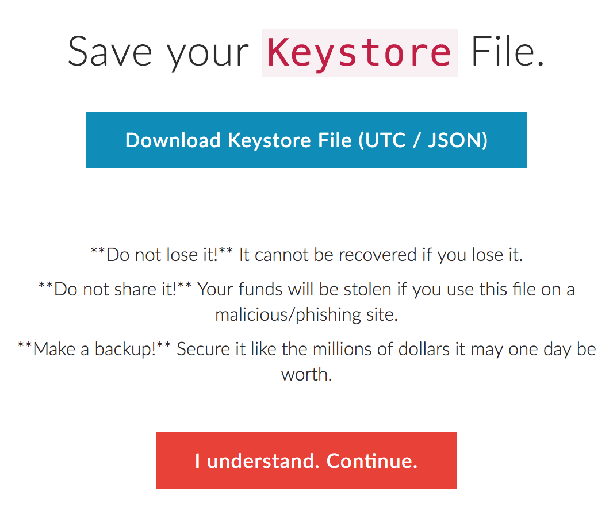
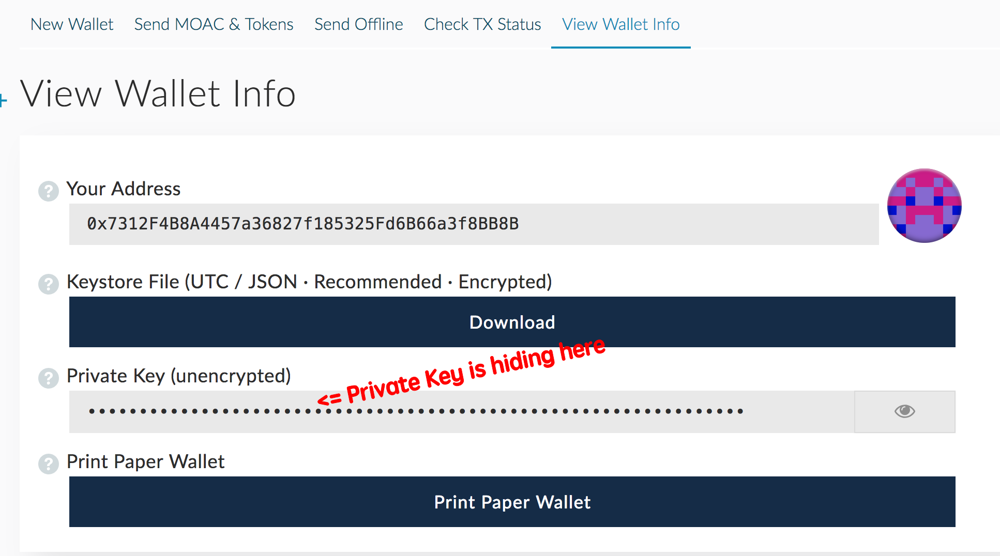
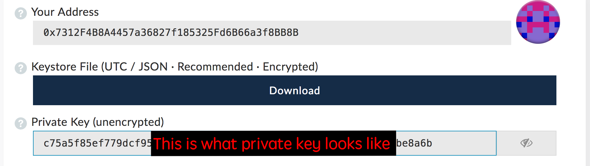

What are the different types of private key formats that I can use to access my wallet?

The MOAC is stored on the blockchain, your MOAC private key or Keystore File or whatever piece of information you have proves ownership of that MOAC, which allows you to move it.

At the end of the day, you are always signing with your private key.

However, for additional functionality (like protecting it with a password) there are formats & ways of storing your private key:

### Keystore File (UTC / JSON)
* This is encrypted by the password you chose.
* This is the recommended version to save.
* This Keystore file matches the format used by Mist so you can easily import it in the future.
* Make sure to have multiple backups.

### Private Key (unencrypted)

* This is the unencrypted text version of your private key, meaning no password is necessary.
* If someone were to find your unencrypted private key, they could access your wallet without a password.
* For this reason, encrypted versions are typically recommended. To learn about how you can encrypt your private key, click here for more information.
* However, you should print the paper wallet or save this in an offline environment (like a piece of paper or USB drive). This ensures a lost password does not result in lost MOAC, and acts as another backup.

You can check the actual conent of the private key but be sure not to discolose to anybody suspicious.

### MetaMask
You can use Metamask to save your keypairs but currently MetaMask do not support MOAC transaction yet.

### Ledger or TREZOR or Digital Bitbox Hardware Wallets

You can use TREZOR or Digital Bitbox Hardware Wallets to store the MOAC keypairs but they do not support MOAC transaction yet. 
