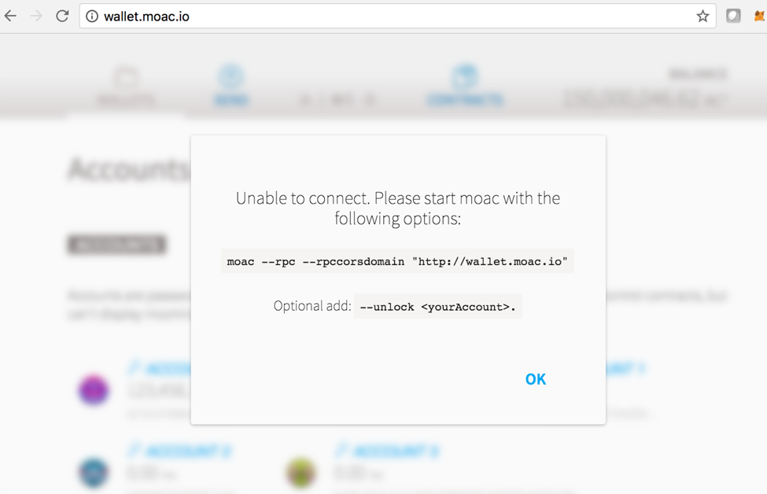
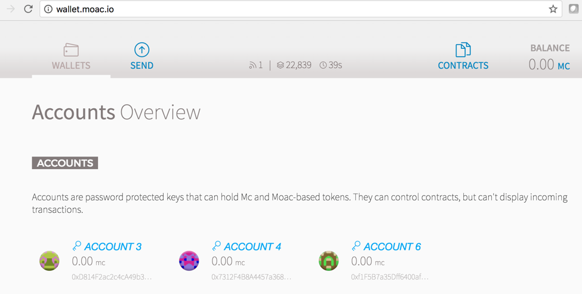
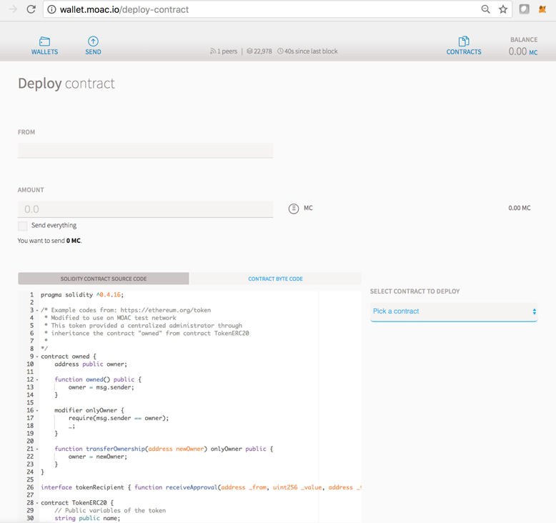
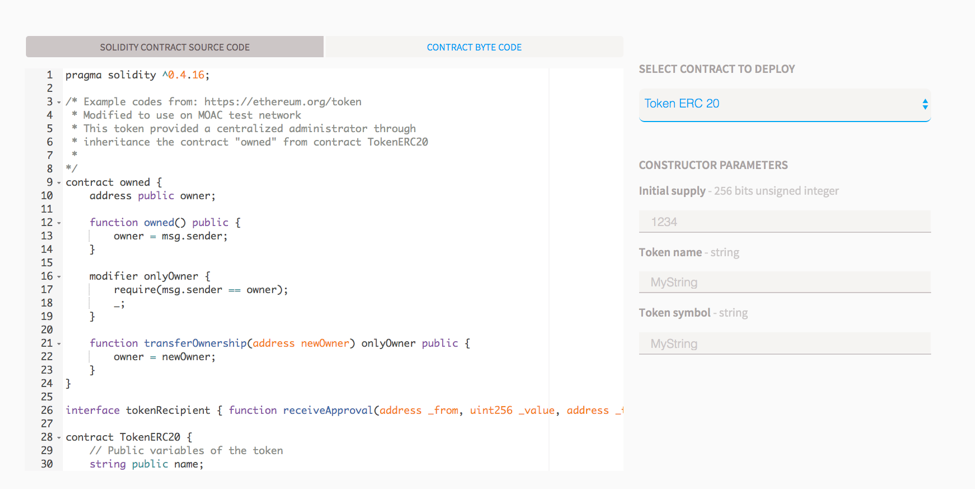
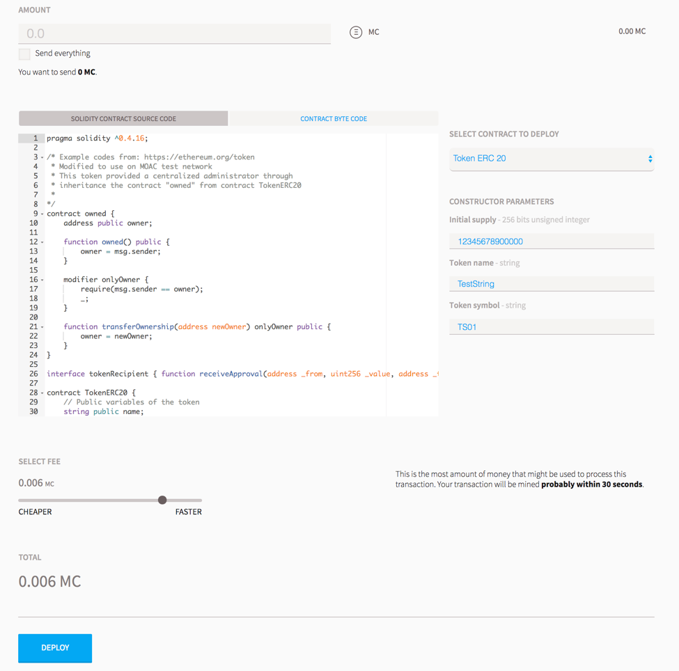
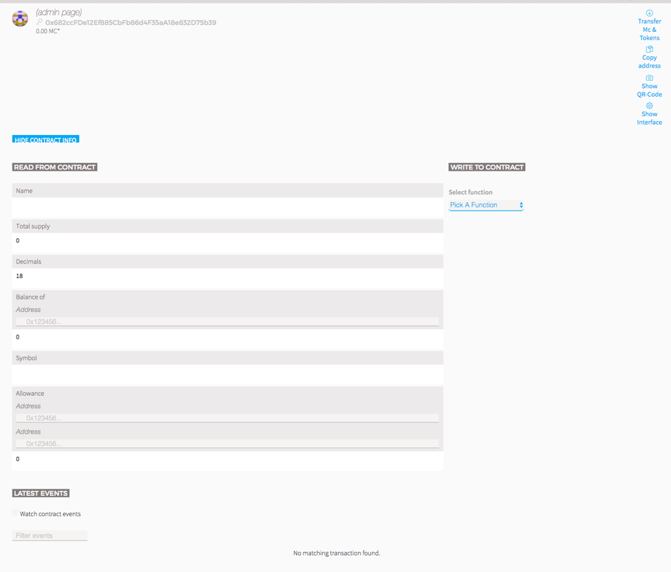
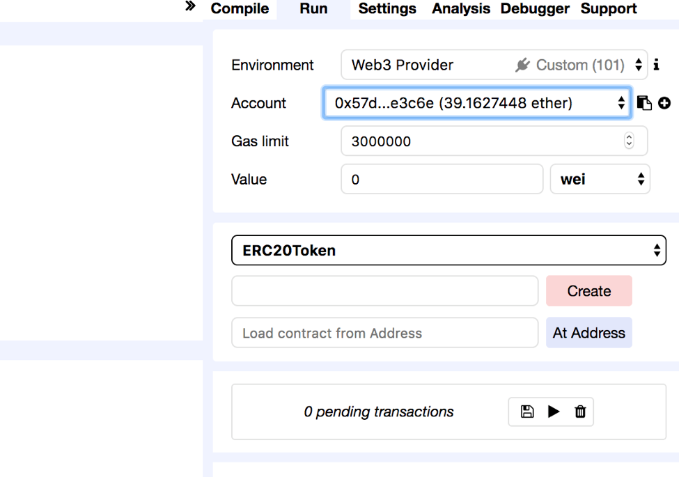

## Creating your own ERC721 Token on MOAC blockchain

Before you read this page, you should:

* Understand the following general concepts: blockchain, smart contracts, ERC721 tokens;
* Be able to write a basic Ethereum smart contract in Solidity (see tutorial example);

After you read this page, you will be able to:

* Write your own ERC721 token contract;
* Compile and deploy it on the MOAC blockchain;
* Use the ERC721 token;


## Write the ERC721 token smart contract

The [ERC721 standard](https://github.com/ethereum/EIPs/blob/master/EIPS/eip-721.md) is developed by the Ethereum community. It is a standard interface for non-fungible tokens(NFT), also known as deeds.

	contract ERC721 {
		function balanceOf(address _owner) external view returns (uint256);
		function ownerOf(uint256 _tokenId) external view returns (address);
		function safeTransferFrom(address _from, address _to, uint256 _tokenId, bytes data) external payable;
		function safeTransferFrom(address _from, address _to, uint256 _tokenId) external payable;
		function transferFrom(address _from, address _to, uint256 _tokenId) external payable;
		function approve(address _approved, uint256 _tokenId) external payable;
		function setApprovalForAll(address _operator, bool _approved) external;
		function getApproved(uint256 _tokenId) external view returns (address);
		function isApprovedForAll(address _owner, address _operator) external view returns (bool);
		function supportsInterface(bytes4 interfaceID) external view returns (bool);
		event Transfer(address indexed _from, address indexed _to, uint256 _tokenId);
		event Approval(address indexed _owner, address indexed _approved, uint256 _tokenId);
		event ApprovalForAll(address indexed _owner, address indexed _operator, bool _approved);
	}

User can develop its own ERC721 token. For that, we can either use a ready open source library to help with the task, or write the needed smart contracts directly from scratch. We will show all three methods below so you can master your ERC721 token development skills.

### Using a ready open source library

Let’s see how you can implement this interface by taking advantage of the OpenZeppelin Solidity library, for instance. We will write a TestCoin based on, for example, the PausableToken contract in OpenZeppelin:

	pragma solidity ^0.4.18;
	
	import "./ERC721Basic.sol";
	import "./ERC721Receiver.sol";
	import "../../math/SafeMath.sol";
	import "../../AddressUtils.sol";
	
	contract ERC721BasicToken is ERC721Basic {
	  using SafeMath for uint256;
	  using AddressUtils for address;
	
	  // Equals to `bytes4(keccak256("onERC721Received(address,uint256,bytes)"))`
	  // which can be also obtained as `ERC721Receiver(0).onERC721Received.selector`
	  bytes4 constant ERC721_RECEIVED = 0xf0b9e5ba;
	
	  // Mapping from token ID to owner
	  mapping (uint256 => address) internal tokenOwner;
	
	  // Mapping from token ID to approved address
	  mapping (uint256 => address) internal tokenApprovals;
	
	  // Mapping from owner to number of owned token
	  mapping (address => uint256) internal ownedTokensCount;
	
	  // Mapping from owner to operator approvals
	  mapping (address => mapping (address => bool)) internal operatorApprovals;
	
	  modifier onlyOwnerOf(uint256 _tokenId) {
	    require(ownerOf(_tokenId) == msg.sender);
	    _;
		  }
	
	modifier canTransfer(uint256 _tokenId) {
	require(isApprovedOrOwner(msg.sender, _tokenId));
	_;
	}

	function balanceOf(address _owner) public view returns (uint256) {
	require(_owner != address(0));
	return ownedTokensCount[_owner];
	}
	
	function ownerOf(uint256 _tokenId) public view returns (address) {
	address owner = tokenOwner[_tokenId];
	require(owner != address(0));
	return owner;
	}
	
	function exists(uint256 _tokenId) public view returns (bool) {
	address owner = tokenOwner[_tokenId];
	return owner != address(0);
	}
	
	function approve(address _to, uint256 _tokenId) public {
	address owner = ownerOf(_tokenId);
	require(_to != owner);
	require(msg.sender == owner || isApprovedForAll(owner, msg.sender));

    if (getApproved(_tokenId) != address(0) || _to != address(0)) {
      tokenApprovals[_tokenId] = _to;
      emit Approval(owner, _to, _tokenId);
	    }
	}
	
	function getApproved(uint256 _tokenId) public view returns (address) {
	return tokenApprovals[_tokenId];
	}
	
	function setApprovalForAll(address _to, bool _approved) public {
	require(_to != msg.sender);
	operatorApprovals[msg.sender][_to] = _approved;
	emit ApprovalForAll(msg.sender, _to, _approved);
	}
	
	function isApprovedForAll(
	address _owner,
	address _operator
	)
	public
	view
	returns (bool)
	{
	return operatorApprovals[_owner][_operator];
	}
	
	function transferFrom(
	address _from,
	address _to,
	uint256 _tokenId
	)
	public
	canTransfer(_tokenId)
	{
	require(_from != address(0));
	require(_to != address(0));
	
    clearApproval(_from, _tokenId);
    removeTokenFrom(_from, _tokenId);
    addTokenTo(_to, _tokenId);

	    emit Transfer(_from, _to, _tokenId);
	}
	
	function safeTransferFrom(
	address _from,
	address _to,
	uint256 _tokenId
	)
	public
	canTransfer(_tokenId)
	{
	// solium-disable-next-line arg-overflow
	safeTransferFrom(_from, _to, _tokenId, "");
	}
	
	function safeTransferFrom(
	address _from,
	address _to,
	uint256 _tokenId,
	bytes _data
	)
	public
	canTransfer(_tokenId)
	{
	transferFrom(_from, _to, _tokenId);
	// solium-disable-next-line arg-overflow
	require(checkAndCallSafeTransfer(_from, _to, _tokenId, _data));
	}
	
	function isApprovedOrOwner(
	address _spender,
	uint256 _tokenId
	)
	internal
	view
	returns (bool)
	{
	address owner = ownerOf(_tokenId);
	// Disable solium check because of
	// https://github.com/duaraghav8/Solium/issues/175
	// solium-disable-next-line operator-whitespace
	return (
	  _spender == owner ||
	  getApproved(_tokenId) == _spender ||
	  isApprovedForAll(owner, _spender)
	);
	}
	
	function _mint(address _to, uint256 _tokenId) internal {
	require(_to != address(0));
	addTokenTo(_to, _tokenId);
	emit Transfer(address(0), _to, _tokenId);
	}
	
	function _burn(address _owner, uint256 _tokenId) internal {
	clearApproval(_owner, _tokenId);
	removeTokenFrom(_owner, _tokenId);
	emit Transfer(_owner, address(0), _tokenId);
	}
	
	function clearApproval(address _owner, uint256 _tokenId) internal {
	require(ownerOf(_tokenId) == _owner);
	if (tokenApprovals[_tokenId] != address(0)) {
	  tokenApprovals[_tokenId] = address(0);
	  emit Approval(_owner, address(0), _tokenId);
	}
	}
	
	function addTokenTo(address _to, uint256 _tokenId) internal {
	require(tokenOwner[_tokenId] == address(0));
	tokenOwner[_tokenId] = _to;
	ownedTokensCount[_to] = ownedTokensCount[_to].add(1);
	}
	
	function removeTokenFrom(address _from, uint256 _tokenId) internal {
	require(ownerOf(_tokenId) == _from);
	ownedTokensCount[_from] = ownedTokensCount[_from].sub(1);
	tokenOwner[_tokenId] = address(0);
	}
	
	function checkAndCallSafeTransfer(
	address _from,
	address _to,
	uint256 _tokenId,
	bytes _data
	)
	internal
	returns (bool)
	{
	if (!_to.isContract()) {
	  return true;
	}
	bytes4 retval = ERC721Receiver(_to).onERC721Received(
	  _from, _tokenId, _data);
	return (retval == ERC721_RECEIVED);
	}
	}

To understand better all the steps that the inheritance from PausableToken has achieved in making our TestCoin a useful ERC721-compliant token (and why it can be helpful to start from an open source library like OpenZeppelin), you can follow closely the code of each of the library’s files that were imported after each inheritance and import is fully expanded.

For that, browsing the OpenZeppelin ERC721 token github repo will be very helpful: our TestCoin is inheriting from PausableToken, which itself inherits from StandardToken, which inherits from BasicToken and ERC721, and so on all the way to ERC721Basic and the SafeMath library import. 

### Developing your smart contract directly

Another way of doing this is to simply write the ERC721 interface and your contract implementing it directly from scratch. As you’ll see, this is actually a fairly straightforward task:

	pragma solidity ^0.4.16;
	
	contract ERC721Token {
	  uint256 public totalSupply;
	
	  function balanceOf(address _owner) public constant returns (uint256 balance);
	  function transfer(address _to, uint256 _value) public returns (bool success);
	  function transferFrom(address _from, address _to, uint256 _value) public returns (bool success);
	
	  function approve(address _spender, uint256 _value) public returns (bool success);
	
	  function allowance(address _owner, address _spender) public constant returns (uint256 remaining);
	
	  event Transfer(address indexed _from, address indexed _to, uint256 _value);
	  event Approval(address indexed _owner, address indexed _spender, uint256 _value);
	}
	
	contract TestToken is ERC721Token {
	
	  string  public name = "Test Coin";
	  string  public symbol = "TEST";
	  uint8   public decimals = 6;
	  uint256 public INITIAL_SUPPLY = 100000000 * (10 ** uint256(decimals));
	
	  mapping (address => uint256) balances;
	  mapping (address => mapping (address => uint256)) allowed;
	
	  function TestToken() {
	    totalSupply = INITIAL_SUPPLY;
	    balances[msg.sender] = INITIAL_SUPPLY;
	  }
	
	  function transfer(address _to, uint256 _value) public returns (bool success) {
	    require(balances[msg.sender] >= _value && balances[_to] + _value > balances[_to]);
	    require(_to != 0x0);
	    balances[msg.sender] -= _value;
	    balances[_to] += _value;
	    emit Transfer(msg.sender, _to, _value);
	    return true;
	  }
	
	  function transferFrom(address _from, address _to, uint256 _value) public returns (bool success) {
	    require(balances[_from] >= _value && allowed[_from][msg.sender] >= _value);
	    balances[_to] += _value;
	    balances[_from] -= _value;
	    allowed[_from][msg.sender] -= _value;
	    emit Transfer(_from, _to, _value);
	    return true;
	  }
	
	  function balanceOf(address _owner) public constant returns (uint256 balance) {
	    return balances[_owner];
	  }
	
	  function approve(address _spender, uint256 _value) public returns (bool success) {
	    allowed[msg.sender][_spender] = _value;
	    emit Approval(msg.sender, _spender, _value);
	    return true;
	  }
	
	  function allowance(address _owner, address _spender) public constant returns (uint256 remaining) {
	    return allowed[_owner][_spender];
	  }
	}

You can get this file directly from OpenZeppelin’s GitHub repo or copy paste the code above and edit it as needed. Make sure to save your contract to a local file on your computer (e.g. ERC721BasicToken.sol). However, the code is only for demonstration only.

## Compile and deploy ERC721 token smart contract

As a next step, you’ll need to generate the bytecode and ABI for your new smart contract. You can think of the bytecode as basically your contract’s compiled code. The ABI (Application Binary Interface) is a JavaScript Object that defines how to interact with your smart contract.

We will show three ways of achieving this as well - using [MOAC wallet](http://wallet.moac.io/), [Remix web IDE for Solidity development](http://remix.ethereum.org/),  or compiling using the solc compiler on your machine (i.e. the command line).

### Using MOAC wallet
MOAC wallet is an online free, client-side interface for using MOAC wallets, make transactions and deploy contract. It was developed based on open-source software. 
To use the service, you need to run a local MOAC node with addition command line arguments:

	--rpccorsdomain "http://wallet.moac.io"

This will allow the access of MOAC node using MOAC wallet.

Otherwise you will see the following error message:



Example command to start a MOAC node connecting with mainnet:

`moac --rpccorsdomain "http://wallet.moac.io" --rpc --rpcport "8545" --rpcapi "chain3,mc,net,db"`


A successful interface connecting to mainnet looks like this:



To compile the contract, click the “CONTRACTS” icon:


Then enter the contract deploy page:


Copy the source code and paste in the “SOLIDITY CONTRACT SOURCE CODE” section. After copying the source code, the compiling process will automatically started. If no errors are not found, the right side should show a “SELECT CONTRACT TO DEPLOY” menu.

Select the contract name “TokenERC721”:

Input the parameters values from the menu:

You need to have enough balance to deploy the contract. You can choose the amount of fee to use when deploying the contract.
Click the DEPLOY button:


This is the contract ready to send from Account 1. The Provide gas is estimated by the compiler and we suggest you use it or put a larger number. If gas is not enough, the contract cannot be created. 
To continue, be sure to unlock the account to create the contract. You can use a console attached to the MOAC to do this:


After deploying, the interface is returned to the main menu and you can see the following transaction is creating.


After 12 confirmations, you can start using the contract by click the admin page link.


MOAC wallet is good for beginners that only need basic contract development needs. It cannot debug contracts. To advanced developers, you can use Remix to work with contracts.

### Remix 
Remix is an online tool developed by Ethereum community to work with smart contracts. 
MOAC also supports the deploy of smart contract through Remix.

Open Remix on your browser, create a new file called ‘TestToken.sol’ and copy paste the code of your smart contract. Make sure you are including all the other Solidity files that your code is referencing with imports, especially if you are using the open source library approach.

Select ‘TestToken’ in the Compile window then click “Start to Compile” and the Details button next to TestToken. Upon scrolling in the popup details window for TestToken, you should be able to see similar sections to this Remix screenshot for the bytecode and ABI of your smart contract:

If the contract is compiled successfully, remix will show the interface like this:


To deploy the contract, you need to connect REMIX to a local or remote MOAC node. In addition to other arguments, be sure to enable the access of REMIX to the MOAC node with 

	moac --rpccorsdomain "http://remix.ethereum.org" --rpc --rpcport "8545" --rpcapi "chain3,mc,net,db"

Click the Run Tab and you should see the following menu:


Choose the Environment menu:
JavaScript VM is a simulated environment of Remix, it can be use to debugging the contract without actually deploying the contract to a real network.
Injected Web3 is the default web3 connecting to Ethereum network.
To deploy MOAC contract, you need to choose Web3 Provider.


After choose “Web3 Provider”, you can see a message like this:

Click “OK”,


You need to make sure the port is the same as the local running node.


You may see the error message like this:


If you see this error message, check the local node that include both 

	--rpccorsdomain "http://remix.ethereum.org" 

and
 
	--rpcport "8545"


If the connection is established, you should see your accounts from the Account List.



Before you deploy the contract, you need to unlock the account that send the contract. You can do the unlock with the MOAC console:


After successfully deployed the contract, you should see the contract address and other information showed in the menu:


Remix is good for developing and debugging smart contracts. It is not very convenient to deploy multiple contracts. If your requires to deploy multiple contracts, you can use the Node.Js packages.

### Using the Node.Js packages

You need to install solc package to compile the smart contract, and chain3 package to deploy the contract.

To use the latest stable version of the Solidity compiler via Node.js you can install it via npm:

```bash
npm install solc
```

	var solc = require('solc')
	var input = 'contract x { function g() {} }'
	// Setting 1 as second paramateractivates the optimiser
	var output = solc.compile(input, 1)
	for (var contractName in output.contracts) {
	        // code and ABI that are needed by web3
	        console.log(contractName + ': ' + output.contracts[contractName].bytecode)
	        console.log(contractName + '; ' + JSON.parse(output.contracts[contractName].interface))
	}


To deploy the contracts, you need to install the Chain3 package:


```bash
npm install chain3
```

There is an example file in the package:
example/contract_deploy.js


After successfully deploy, you should see the contract is displayed

	Succeed!:  0x95d703ea48477f48335ae9c477ce6d986bc68453dfe3d6582714045456b93405

Using solc compiler to generate the ABI and bytecode
Another way of generating these two files is to compile your smart contract using the solc compiler on your machine. If you haven’t used solc yet, you can follow these instructions for installing it on your machine.

Open a Terminal window and navigate to your working directory where you have saved your TestToken.sol file. Run the following command to export the ‘TestToken.abi’ and ‘TestToken.bin’ files to the bin directory:

	solc --bin --abi -o bin TestToken.sol 

As the file extensions suggest, ‘TestToken.abi’ contains your contract's ABI, and ‘TestToken.bin’ contains its bytecode.

If you prefer accessing the solc compiler from within a program’s code to generate the ABI and bytecode files rather than using the command line, you can use the following code instead:

	var fs =  require ( ' fs ' );
	var solc =  requires ( 'solc' );
	
	var cmds = process.argv;
	if(cmds != null && cmds.length > 2){
	  var file = cmds[2];
	  var name = cmds[3];
	  var content = fs.readFileSync(file).toString();
	
	  was input = {
	    file: content
	  };
	
	  var output = solc.compile({sources: input}, 1);
	  console.log('contracts', Object.keys(output.contracts));
	
	  var ctt = output.contracts[name];
	  if(ctt == null){
	      return;
	  }
	
	  var bytecode = ctt.bytecode;
	  var abi = JSON.parse(ctt.interface);
	
	  console.log('bytecode', bytecode);
	  console.log('abi', ctt.interface);
	}

Regardless of which method you followed, you should now have the ABI and bytecode files for your TestToken smart contract. Next, you will be able to deploy your token contract on the MOAC blockchain for others to interact with it.
