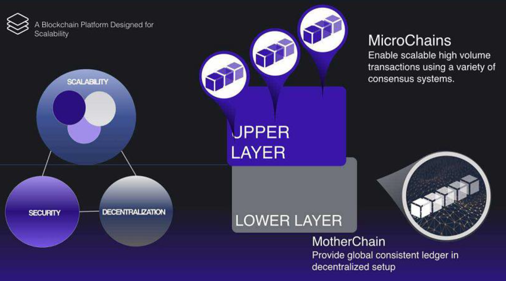

Here are some FAQs from the community. If you cannot find your answers here or have more questions, please feel free to check [Issues](https://github.com/MOACChain/moac-core/issues), or send an email to us.

Table of Contents
=================
  * [What is MOAC](#what-is-moac)
  * [What is MOAC for](#what-is-moac-for)
  * [Why was MOAC created?](#why-was-moac-created)
  * [Why is MOAC so much better for DAPPs?](#why-is-moac-so-much-better-for-dapps)
  * [How to get MOAC?](#how-to-get-moac)
  * [MoacWalletOnline FAQs](#moacwalletonline-faqs)

## What is MOAC?

MOAC is a revolutionary platform with a Multi-Blockchain smart contract and P2P service network to efficiently build and scale decentralized applications. By leveraging Multi-Blockchain sharding, the MOAC platform increases system capacity and performance, reduces transaction fees for smart contracts, and incentivizes mobile and desktop users to compete for processing rewards.

The platform is a Multi-Blockchain software and deployment service solution for rapid development of decentralized applications (Dapps) and smart contracts on a scalable P2P service network. By using an advanced layered architecture for asynchronous smart contracts and a variety of configurable consensus systems (including “proof of work” and “proof of stake”), the MOAC platform enhances existing Dapps with additional functionality, and scalability solutions. This advancement increases processing speed by several levels of magnitude (10-100x) and sets a new market standard for transactional efficiency, while optimizing decentralization mechanisms and overall security.

## What is MOAC for?

The MOAC platform was designed to increase and maximize blockchain network performance using node-based computing power and allowing for on-demand, timed, and savable smart contract processing. The platform provides tools and APIs to application developers to quickly build complex Dapps that can leverage both “proof of work” and “proof of stake” and other scalable consensus systems on a decentralized P2P service network. In turn, and as a result of increased volume and speed of processing, the new MotherChain standard incentivizes the user community and drives increased participation - including users with low processing power (i.e., mobile users).

**Platform build for applications**

* 	New architecture for applications
* 	Easy adoption,  low cost
* 	100x TPS improvement over Ethereum

**Open ecosystem**

* Smart Contract as a Micro-chain (SAAM)
* Cross-chain capability
* Two levels of mining encourage massive participants

## Why was MOAC created?

Existing blockchain technologies and platforms suffer from steep learning curves, unnecessary complexity, and high usage fees all of which impact adoption and scalability. Technically, existing platforms have low transactions-per-second, have fixed consensus models, and are not able to quickly adapt to the ever growing needs of developers. These blockchain platforms are also alienated from each other, and unable to communicate effectively with other cryptocurrencies, smart contracts, and blockchain systems, creating a highly segregated blockchain marketplace. To make matters even more complicated, most blockchains are difficult to upgrade, and split participation inefficiently between users.

MOAC has addressed the primary inefficiencies of existing blockchain platforms by developing a Multi-Blockchain architecture that lowers Dapps costs, provides for scalability, and reduces development complexity while also increasing transaction speeds and volume using sharding. MOAC leverages multiple blockchains within its platform, including MotherChain (Proof of Work), a Dapp Chain (Proof of Stake or any other consensus protocol, see below sections) for scalable transactions, Microchains for Smart Contracts, and Cross-Chain capabilities for interacting between multiple blockchains and cryptocurrencies for improved efficiency, and scalability.

By separating balance transfer and smart contracts, the MOAC Platform can outperform Ethereum by 100x transactions per second using an advanced Mutli-blockchain system including Microchains and sharding.

## Why is MOAC so much better for DAPPs?

First, MOAC uses blockchain sharding to speed up the TPS, making it an attractive platform for DAPP developers and users.

Secondly, it redefines how DAPP developers and users interact with the system from the monetization standpoint. Most existing systems assume unfair burden on DAPP users: not only DAPP do they have to pay each transaction fee, but they also have a steep learning curve to climb on how blockchain works. With MOAC, there is no need to know anything about the underlying system before using the DAPP, and no need to acquire any underlying token unless the use case itself really commands it.

Thirdly, MOAC adds new ways to redistribute tokens to a wide range of participants, thus further supporting decentralization. Thanks to the second layer’s mining, each DAPP will pay its miners continuously all throughout the lifetime of the DAPP. And because the second layer’s mining does not need to calculate a random number, every CPU (including mobile devices) can participate as potential nodes. This greatly encourages participants in masses to provide the processing power to support more DAPPs and get incentivized accordingly.

Finally, since DAPPs are deployed in a virtual machine of the developer’s choice, they do not require additional programming. MOAC is able to run existing Ethereum smart contracts with lower fees, and developers can leverage the MOAC API to expand their existing smart contract with additional functionality without having to learn how to program on the blockchain.

## How to get MOAC?

MOAC's mainnet was released on April 30th, 2018. Now you can get MOAC on the mainnet through the following options:

1. User can mined the MOAC out using the released go client. 
2. If you have any ERC20 token, you can also exchange your ERC20 token to Moac on the mainnet by contacting . 
3. Exchange MOAC with other crypto-tokens: There are several exchanges that currently listed MOAC. You can find more info on [this link](https://www.feixiaohao.com/currencies/moac/).
  
If you want some moac on the testnet, you can mine on the testnet, put your receiver address [here](https://github.com/MOACChain/moac-core/issues/1) or contact the  [MOAC team](info@moac.io).

## MoacWalletOnline FAQs

[How To Create a Wallet](How-To-Create-a-Wallet)

[Differences between wallet types](Differences-Between-Wallet-Types)
       
[How to Properly Save & Back Up Your Wallet](SaveAndBackup)
	
[How To Access Your Wallet](accessWallet)
	
[Protecting Yourself and Your Funds](protectFunds)
	
[Checking the Balance of Your Account](checkBalance)

