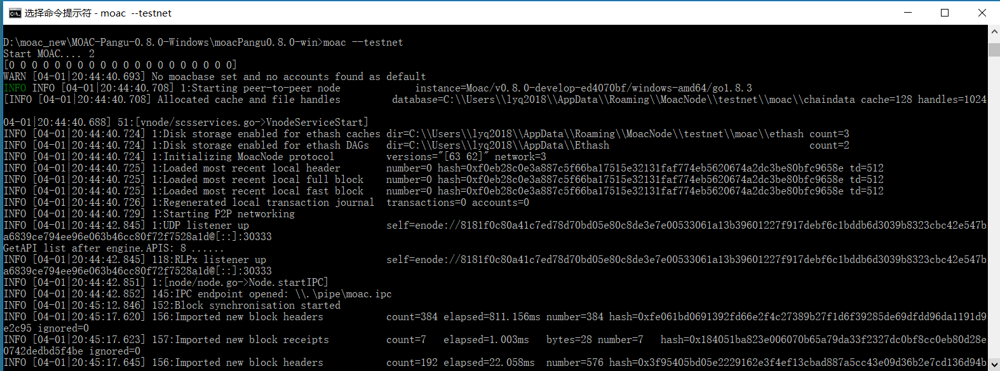
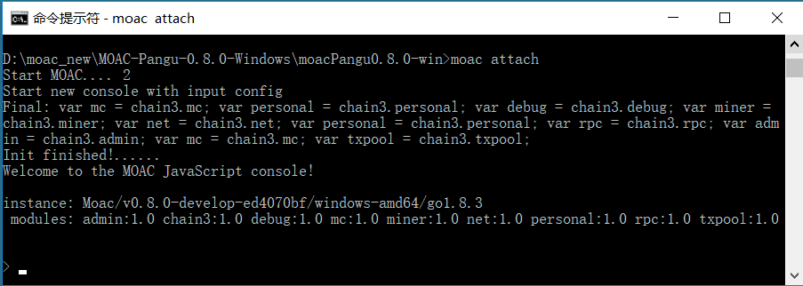
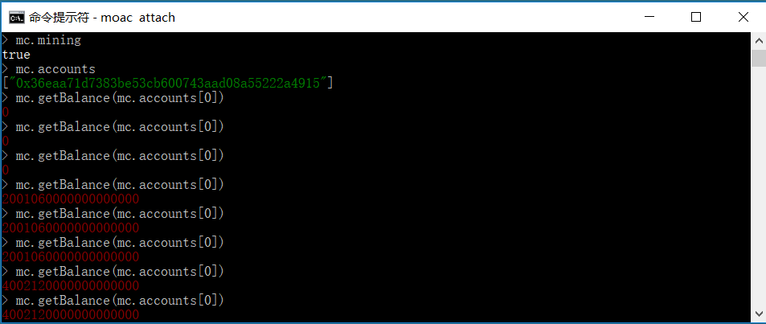
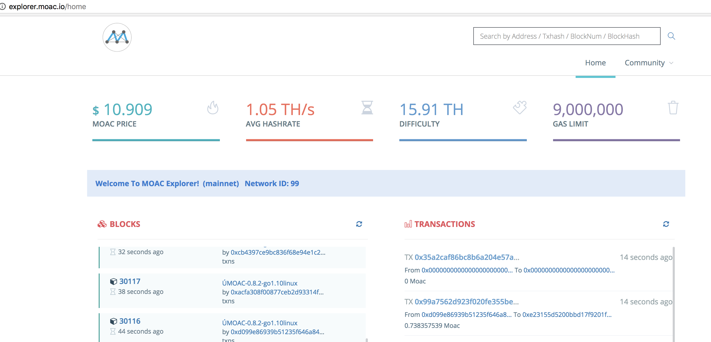
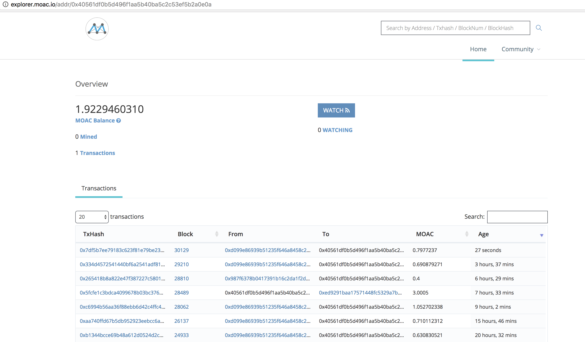
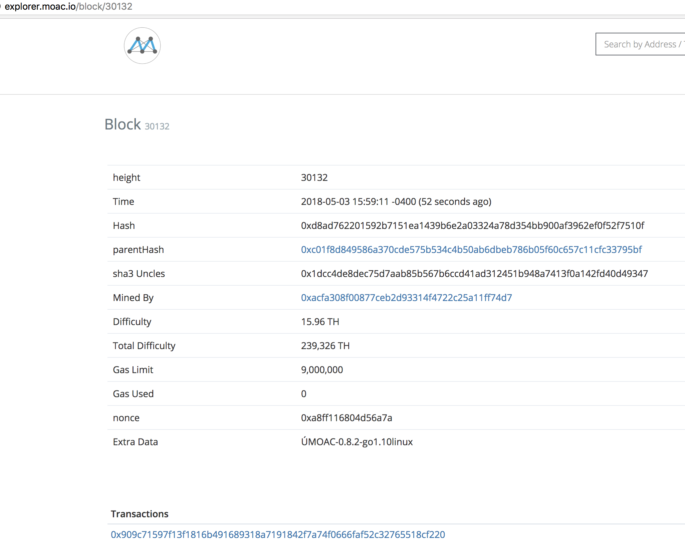
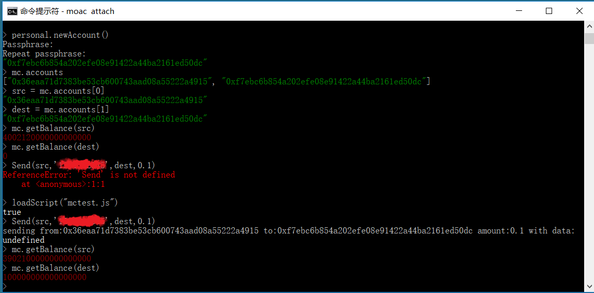

## MOAC release

Download from latest release version of VNOE from [release link](https://github.com/MOACChain/moac-core/releases) 


### Debian/Ubuntu/CentOS

1. Untar the file using tar, under the directory, run
./moac

To see the help, use
./moac --help

To enable the console, run:
./moac console

A mainnet directory will be created under $HOME/.moac/
and some info should be seen as:

    INFO [04-24|11:24:26.506] 86161:IPC endpoint closed: /home/user/.moac/moac.ipc 

from another terminal, run moac again to attach the running node

	./moac attach 

or 

	./moac attach $HOME/.moac/moac.ipc

2. from console prompt, create coinbase account

		>personal.newAccount()

3. from console prompt, start mining by running

		>miner.start()

4. from another terminal, run moac again to attach the running node
	
		./moac attach

5. from prompt, load script
	
		>loadScript("mctest.js")

6. check if miner has mined any moac by checking:

		>mc.accounts

7. create another account

		>personal.newAccount()


8. try send from one account to another:

		>Send(mc.accounts[0], '', mc.accounts[1], 0.1)


#### WINDOWS

Unzip the file to a directory, under the directory, run


##### 2.1  查看moac帮助

打开命令（cmd）终端，转到墨客解压目录，在命令行中执行：
```
D:\moacPangu0.8.2-win>moac --help
```

显示帮助信息，包含但不限于以下内容：

查看moac帮助

打开命令（cmd）终端，转到墨客解压目录，在命令行中执行：

```
D:\ moacPangu0.8.2-win>moac --help
```
显示帮助信息，包含但不限于以下内容：
```
Start MOAC.... 2
NAME:
 moac - the MOAC-core command line interface
 Copyright 2017 The MOAC Authors
USAGE:
 moac [options] command [command options] [arguments...]
VERSION:
 0.8.2-develop-ed4070bf
MOAC CORE OPTIONS:
--config value                      TOML configuration file
--datadir "C:\Users\[userName]\AppData\Roaming\MoacNode" Data directory for the databases and keystore
--keystore                         Directory for the keystore (default = inside the datadir)
--nousb                           Disables monitoring for and managing USB hardware wallets
--networkid value                   Network identifier (integer, 1=Pangu, 2=Testnet) (default: 1)
--testnet                          MOAC test network: pre-configured proof-of-work test network
```

##### 2.2 运行节点

打开命令（cmd）终端，转到墨客当前目录，在命令行中执行：
```
D:\ moacPangu0.8.2-win>moac
```
显示如下信息：



至最后三行显示如下：
```
INFO [04-01|20:44:42.851] 1:[node/node.go->Node.startIPC]
INFO [04-01|20:44:42.852] 145:IPC endpoint opened: \\.\pipe\moac.ipc
INFO [04-01|20:45:12.846] 152:Block synchronisation started
```
表示节点安装成功，如果网络正常，就开始同步区块。

系统将MOAC节点默认安装在目录：
```
C:\Users\[userName]\AppData\Roaming\MoacNode\
```
该目录下包含两个文件夹：moac和keystore。

##### 2.3 进入MOAC console界面

系统关机或主动关闭运行中的节点后，如果需要重新启动节点，在命令行中执行：
```
D:\ moacPangu0.8.2-win>moac console
```
之后一直滚屏以同步区块数据。


打开另一个命令（cmd）终端，转到墨客当前目录，在命令行中执行：
```
D:\ moacPangu0.8.2-win>moac attach
```



该命令行不会主动滚屏，而是等待命令。

#### 3. 挖矿

##### 3.1 建立新账户

挖矿前必须建立一个自己的账户。

进入MOAC console界面，执行命令：
```
> personal.newAccount()
```
系统会提示输入一个密码，例如"passwd"，并再次输入相同密码确认后，会显示一个以0x开头的字符串，即为MOAC帐号的公开地址。


系统同时会在以下目录：
```
C:\Users\[userName]\AppData\Roaming\MoacNode\testnet\keystore
```
记录一个账号文件。请保存好该文件，并牢记密码，之后用于解密帐号和操作。

##### 3.2 查看账户

进入MOAC console界面，执行命令：
```
> mc.accounts
```
可以查看本节点下的所有账号。

##### 3.3 查看账户余额

进入MOAC console界面，执行命令：
```
> mc.getBalance(mc.accounts[0])
```
可以查看本节点下的账号余额。0表示第一个账户，也是默认挖矿账户。

或者：导入“mctest.js”的情况下（见4.1），执行命令：
```
> checkBalance()
```
该命令用于查看当前节点所有账号的余额。

##### 3.4 查看挖矿状态

进入MOAC console界面，执行命令：
```
> mc.mining
```
返回true表明节点正在挖矿，false表明节点没有挖矿。

##### 3.5 开始挖矿

进入MOAC console界面，执行命令：
```
> miner.start()
```
挖矿状态下，数据显示有明显不同。


挖到矿之后，可以查看余额



登录墨客区块链浏览器页面： http://explorer.moac.io。




在搜索栏输入你的挖矿账号地址，会显示该账号的余额等信息。



在搜索栏输入你挖到矿的区块号，会显示该区块的信息。

Miner正是你的账号地址。



##### 3.6 停止挖矿

进入MOAC console界面，执行命令：
```
> miner.stop()
```

#### 4. 交易

##### 4.1 读入测试函数

部分功能程序存储在mctest.js里。

进入MOAC console界面，执行命令：
```
> loadScript("mctest.js")
```

##### 4.2 交易条件

为执行交易，需要至少两个帐号，其中一个有足够的mc。

如果没有目标账号，可以用步骤2.3.1的命令创建一个本地账号。并用命令：
```
> mc.accounts
```
显示当前节点中存储的账号，应该至少有一个挖矿账号。

##### 4.3 交易

进入MOAC console界面，执行命令：
```
> Send(mc.accounts[0], 'passwd', mc.accounts[1], 0.1)
```
这个过程需要第一个账号的密码。比如'passwd'，发送额为0.1 mc。



在系统挖矿的情况下，发送应该在下一个区块产生时完成。

系统显示的是以 **sha（Sand）** 为单位的余额， **1 mc = 1e18 sha。**
