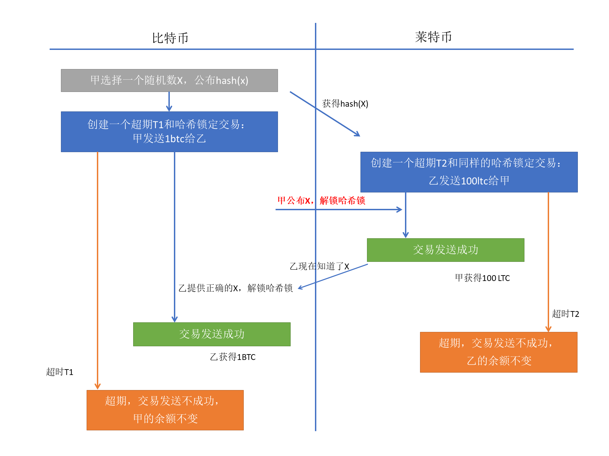
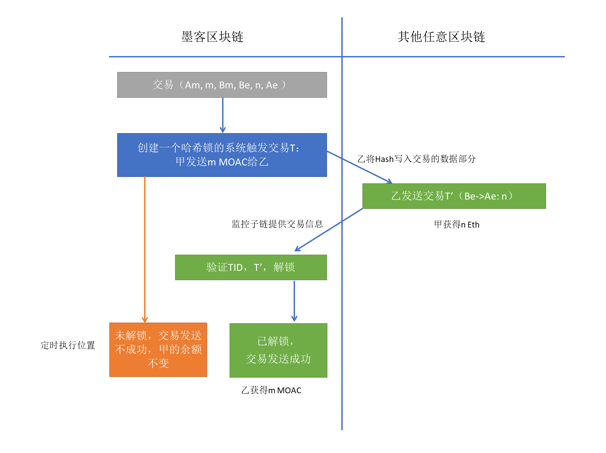
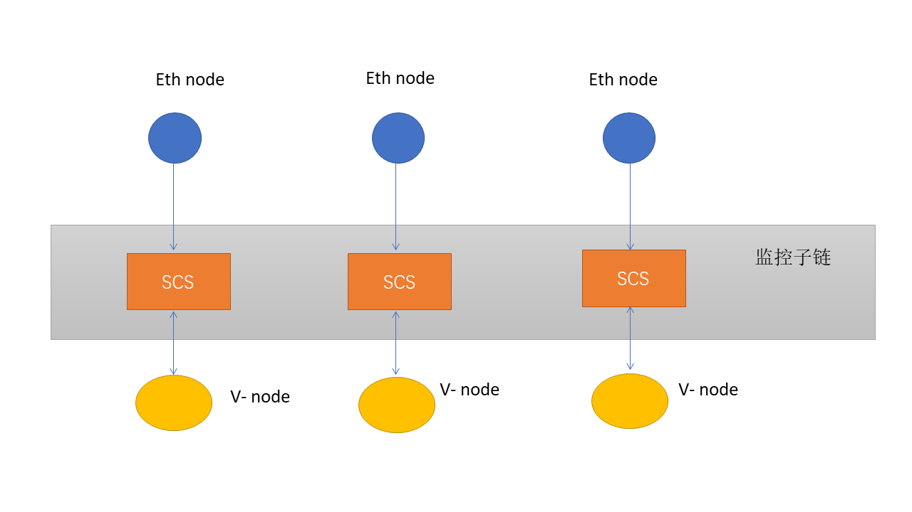

#### 1. 区块链技术的痛点
以下以区块链应用的主要平台以太坊为例，表述现有区块链技术的缺陷和痛点。

##### 1.1 处理能力很低，可扩展性比较差

以太坊目前能够支持的TPS非常有限，大概15-30 TPS。所有的节点都处理同样的智能合约，而且所有合约的状态都记录到公共的区块链账本中。这样的系统难以支持成千上万的DAPP的调用和状态存储，一两个受欢迎的应用就可以把以太坊堵死。

##### 1.2 以太坊不是为DAPP所设计的

从中本聪的比特币开始，区块链技术的主要目的是建立一个去中心化的电子货币系统。以太坊在此基础上发展而来，增加了智能合约的功能，但是并没有改变这个本质。以太坊的架构很多方面不适合DAPP。表现在几个方面：

1) DAPP的用户的学习曲线非常陡峭

如果用户需要使用一个基于智能合约的DAPP，他必须先做这么几件事情，第一，他要获得一个钱包地址，私钥，并知道如何正确的使用钱包地址和保存私钥；第二，他必须通过某种方式获得eth。通常的做法是支付昂贵的手续费之后购买一些eth。之后需要等待多日，才可以将购买的eth转移到DAPP的钱包地址。这个过程对区块链的小白来说非常复杂，而且需要等待足够长的时间（大于一周）才能完成，之后才能真正的使用DAPP。

2) 维护DAPP运行的成本不公平的偏向于DAPP的用户

DAPP的创建者部署了合约之后，合约就可以一直运行下去。DAPP的创建者/维护者不再需要为系统的维护支付任何费用。而是把消耗系统资源的成本转嫁到了DAPP的用户，一次部署，无限使用。

3) 不利于构建DAPP的生态。DAPP创建者的主要目的是让更多的用户使用该DAPP,比较小的部署成本和巨大的使用成本，并不是DAPP创建者所真正需要的。基于区块链的DAPP的使用应该跟传统的APP一样，用户从APP store下载了之后就可以立刻免费或者以很低的成本使用APP。用户其实不需要关心底层的区块链是什么样的。他根本不需要关心Eth的存在或者如何获得Eth。

##### 1.3 token主要分配方式是通过挖矿

中本聪的理想是每个拥有计算机和网络的人都可以参与挖矿，并获得虚拟货币。这样，使得比特币的分配可以更加去中心化，让更多的人可以使用比特币。但现实是挖矿已经变得非常昂贵，只有支付得起巨额的矿机和昂贵电力的人才能在这个分配过程中受益。以太坊的挖矿采用GPU，比比特币的ASIC相对好一点，但是依然很昂贵。虽然以太坊尝试转换到POS的共识机制，但是那样仍然维持了强者恒强、富者愈富的场景。以太坊及其他大多数区块链缺乏有效的二次分配token的方式来去中心化。

#### 2. MOAC的方案
墨客区块链（MOAC）通过对以太坊系统架构的革新能够同时解决上面的三个问题，并提供有效的跨链功能。具体的做法如下：

##### 2.1 分层
###### 2.1.1 采用分层结构实现分片

将balance transfer和智能合约分开处理，底层以POW的方式处理所有的balance transfer和全局合约，解决全局一致性和双花的问题。DAPP的智能合约部署在上层，采用分片技术，通过POS或者PBFT的方式实现子片的数据一致性，提高系统TPS至100倍。

墨客的底层节点称为v-node，采用POW挖矿方式。

墨客引入智能合约服务（Smart Contract Server，scs）节点用于处理合约。

通过分层处理，合约在逻辑子链中执行，不会影响到正常用户的交易处理。

每个部署的DAPP合约可以自己选择所需的scs数量及共识方式，有自己的子链来保存状态。子链采用定期刷新的机制将自己状态的hash写入底层区块链，以实现一致性。

###### 2.1.2 费用分担

DAPP的创建者必须支付子链中每个区块的费用，类似以每月支付水电账单的方式维持DAPP的持续运行。

DAPP的使用者可以采用直接调用的方式，不需要支付任何gas费用，对DAPP的应用发起调用。如果需要防止用户滥用，DAPP自己可以实现相应的处理方式。

这样，上层的共识协议不需要消耗大量的能源来获得随机数，而是纯粹处理智能合约的执行或者服务，对系统的要求非常低。普通的嵌入式系统甚至手机都可以参与。节点数量增加，然后通过分片的方式支持成千上万的DAPP运行；反过来，DAPP持续的支付费用可以支持更多的上层矿工。这样就形成了一个开放的，正反馈的循环，使得墨客系统成为一个巨大的，适合DAPP的生态圈。

##### 2.2 分片（sharding）
分片是指将网络中的所有节点分成若干个子群体，这些子群体之间通过预定义的方法执行原来所有节点都要处理的工作，从而达到提高系统处理能力的结果。

以太坊目前的分片策略是在一个周期内，将所有的节点分成若干份，然后将合约分配给每个分片。当周期结束时，会重新分片。这里会有几个问题：

1) 需要一个全局的存储器来保存这个分片信息。

2) 这个周期通常比较长，如果节点数动态变化比较大的话，分片的信息会很容易过时。

3) 周期结束时，当前分片处理的合约必须重新分配到新的分片，造成不必要的切换资源操作。

4) 分片的共识方式与底层的共识一样，这样分片的功能必须等主网切换到POS才能采用。

墨客采用分层的办法来实现分片。

墨客的底层采用POW的方式保证所有的数据的一致性。

分片处理的节点称为SCS，其特点包括：

1) 每个分片有自己的存储，就是子链。

2) SCS可以有不同于底层的共识方式，比如pos，pbft。

3) SCS的区块生成时间可以与底层不一致，比如可以采用快速的区块周期来进一步提高处理速度。

4) SCS周期性的向底层flush结果，从而获得阶段性的全局一致性。

与以太坊分片方法不同，墨客分片采用合约驱动的模式。就是说一个合约对应于一个系统分片。合约创建时自动随机选择相应数量的节点形成一个分片来处理这个合约。这个合约的生存周期包括从创建到结束合约都在这个分片中实现。当然，中间如果需要，可以重新洗牌来选择新的分片节点。

墨客系统提供一个Pos分片实现。用户也可以实现自己的共识协议，作为SCS的一个插件。这样就形成了子链的概念。

合约的执行尽可能都在SCS端执行。V-node只处理支付交易和必要的合约调用。如此可以降低支付交易的gas量，进一步提高处理能力，而不会造成系统太大的负担。

整个系统的处理速度上去之后，会对v-node的要求更高。体现在两个方面，一个是网络的带宽，另一个是存储的容量。当然还有每个节点的GPU运算能力。随着光纤网络和5G网络的普及，带宽预计不会成为一个瓶颈。存储器的价格则更加不是问题。对于普通用户而言，因为有SCS可以参与挖矿，并不一定需要部署一个v-node，只要有信任的v-node可以连就可以。这样墨客系统会形成两个层次的挖矿节点：

1) 大量运算能力强大、高网络带宽、大存储的v-node，执行POW，并提供SCS接入服务，维持整个网络必须的挖矿能力，这个数量在几千到一万。

2) 海量cpu –based的SCS用于处理合约的执行。针对子链的共识多样性，这样的SCS节点甚至可以是手机等移动设备。SCS节点的数量可以不受限制。在目前的架构下，可以有几十万甚至几百万的SCS参与，而不会影响系统的性能。

##### 2.3 子链
区块链有很多概念，比如分叉链，侧链，子链，它们分别都是什么东西呢？

分叉链指的是基于同一个软件的，增减一些功能后单独部署的一个区块链。

侧链指的是与主链相平行的单独一个区块链，但是它和主链之间可以通过相互了解的协议互联。主链的货币可以通过在主链的可验证的锁定，在侧链获得对应的货币，反之亦可。作为主链的补充，侧链可以提供一些主链不能提供的功能。但是这个互联对共识机制有要求，而且侧链必须有与主链相当的算力才能保证侧链货币的安全性。要达到相当的算力，其实完全就成了另外一个单独的链。所以侧链概念出来后一直没有太多的应用。

子链指的是在主链的平台上派生出来的具有其他功能的区块链。这些子链不能单独存在，必须通过主链提供的基础设施才能运行，并且免费获得主链的全部用户。一个简单的例子是以太坊上面的erc20 合约。这个合约可以看成是一个逻辑子链，但是这个子链的共识方式与主链一致。

由于墨客支持大量的子链而不会影响系统的总体性能，并且子链之间拥有良好的交互功能，因而墨客可以架构一个功能强大的立体结构。我们可以设想这么一些墨客的架构场景：

1) 墨客的底层POW挖矿系统提供一个可靠的全局一致的区块链

2) 快速处理智能合约并且能够随时更新SCS节点的PBFT子链

3) 支持快速处理的零知识证明子链

4) 由海量SCS节点（硬件盒子）构成的IPFS分布式文件系统子链

5) 多个面向专业应用的行业子链

6) 分布式子链token交易所

7) 多个连接外部区块链系统的跨链子链

通过各个子链之间灵活的交互功能，一个子链可以使用另外一个子链提供的资源(比如IPFS)，使得接入墨客系统的用户可以获得强大的分布式技术支持，从而使得在此基础上的构建应用变得非常简单，并且能够获得墨客系统的社区资源。

##### 2.4 跨链
当前两个区块链的货币之间的兑换有两种方式，一种是采用线下的方式，找到一个可信的有相反需求的其他买家，甲把A货币转给乙，乙把对应的B货币转给甲。这样的办法比较低效，找到一个可信的对家很难，执行的风险也很大。另外一种方式就是普遍采用的中心化的交易所，大家把各自的货币充值到交易所，交易所在它的系统里面记录每个人的余额，然后兑换就在交易所的平台上面进行，直到买家从交易所取出相应的货币。

中心化的交易平台的问题显而易见。在监管缺失的情况下，中心化交易所可能存在内幕交易，伪造交易，资金挪用等等问题。而且中心化的交易所很容易受到主权机构的控制。

这里通过公布X，同时解锁两个交易，实现跨链交易最重要的原子性问题。

但是这个解决方案有几个问题：

1) 需要跨链的每个链都支持闪电网络，也就是需要哈希锁和时间锁的功能。现有的链如果没有这个功能的话，需要进行硬分叉。很多情况下并不现实。

2) 整个交易的过程是个交互手动的过程。用户乙必须等待甲的公布，之后要确保在对方网络中递交合适的信息。如果需要实现自动化的话，会比较麻烦，需要额外的基础设施支持，比如类似Cosmos的拜占庭容错hub支持。

墨客采用系统特有的系统定时触发功能和子链的功能，完美解决了上述两个问题。

系统定时触发功能是设置在指定的未来区块位置执行某个交易。这个设置是100%会被执行。

墨客具体的跨链这样实现：

1) 找到匹配交易： 在墨客网甲从Am地址发送m个 MOAC：Am -> Bm : m, 另外一区块链网（例如以太坊）中乙从地址Be发n个Eth 到地址Ae，表示为（ Am ->Bm : m ^ Be -> Ae : n ）。

2) 在墨客网络，甲创建一个哈希锁的系统定时触发交易T：Am ->Bm : m on Block#k。甲同时会把m MOAC发送到系统合约作为预备金。计算Hash(T)。

3) 这个系统定时触发交易将在k block后执行这个交易。如果成功，Bm获得m MOAC，否则退回给Am。成功与否依赖于哈希锁是否被解锁：是否有可验证的以太坊交易Be->Ae : n eth，以及Hash(T) 标识。

4) 乙看到系统定时触发交易T后，知道在k block后100%会执行，所以他可以很放心的发送交易Be->Ae : n eth, 同时将Hash(T)放入数据段。

5) 乙在以太坊的交易确认后，监控子链将以太坊的交易信息作为参数调用系统合约，解开hash锁。

6) 到k block之后，系统合约自动执行，完成Am->Bm : m。

这里，墨客区块链通过其他区块链的确认交易信息解锁墨客交易，实现原子操作。

其巨大优越性在于，对其他区块链没有新的要求，只需要交易能附加数据信息，这个功能每个区块链都有。因此，墨客跨链机制可以实现与所有的区块链的跨链操作!

目前墨客系统通过子链来实现拜占庭容错的快速消息传递。

举例：跟以太坊的信息传递

支持同一种自定义共识协议的SCS node之间可以形成一个子链。为了实现墨客系统与以太坊区块链之间的信息传递，SCS node可以同时连接一个eth的light node。

这样，SCS node可以随时获得eth中的需要监控的交易信息。多个SCS node之间通过预定义的共识协议，将对应的操作（比如解锁系统合约的调用请求）发送到v-node层，从而实现跨链信息的拜占庭容错。

综上所述，墨客提供一个与其他所有区块链的跨链方案，同时提供跨链的信息传递，以实现去中心化的跨链交易。但是，不仅限于此，在此构架上可以很方便的实现去中心化的交易所。

##### 2.5 挖矿
MOAC将系统分为两层，底层是POW挖矿，与现有的以太坊系统兼容，现有的以太坊矿机可以很方便的转移到墨客挖矿。上层是SCS node。这样的node数量可以非常巨大，每个部署的子链合约，可以随机挑选出参与挖矿的SCS节点，形成一个共识子网。SCS节点提供服务，并获得报酬。

墨客提出了两级挖矿，上层挖矿提供了一个二次分配的功能。就是子链的部署者需要持续的付出MOAC，分配给参与的scs节点，以维持子链的正常运行。而SCS节点参与挖矿的成本很低，只需要一定的MOAC保证金，对系统的要求很低。这样的挖矿机制使得广大的SCS节点都可以参与并获得收益，从而使得MOAC的二次分配更加广泛。这样，可以极大的调动社区的积极性，形成一个开放的系统。

子链的缺省配置是用moac支付。子链的创建者可以设定每个block的时间间隔，以及每个block的reward。这些reward是由创建者支付。墨客提供一个动态的管理机制，使得即使MOAC本身的价值波动，仍然可以让scs节点有收益，同时子链创建者也不至于负担过重。
